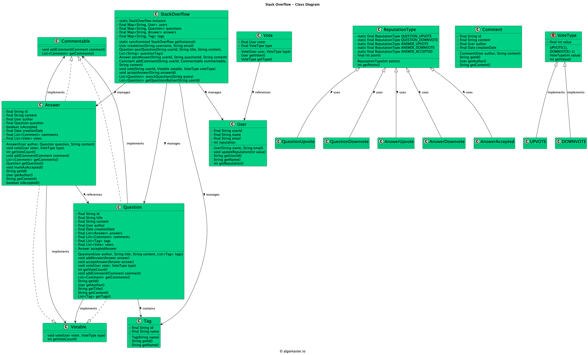

Requirements
Users can post questions, answer questions, and comment on questions and answers.
Users can vote on questions and answers.
Questions should have tags associated with them.
Users can search for questions based on keywords, tags, or user profiles.
The system should assign reputation score to users based on their activity and the quality of their contributions.
The system should handle concurrent access and ensure data consistency.

Step 1: Start with model (DON’T jump to code)

Say:

We have 4 core entities:
- User
- Question
- Answer
- Comment

Question owns answers
Both Question & Answer can have comments

Step 2: Introduce abstraction
Since Question & Answer share behavior (comments, voting),
I’ll introduce a base Post class

Step 3: Add service layer
I’ll use a service layer to manage:
- question creation
- answering
- comments

Step 4: THEN write code (like yours)

Step 5: Explicitly say this (VERY IMPORTANT)
This is an in-memory design.
I’ll extend it with:
- search indexing
- reputation system
- concurrency control

👉 This single statement boosts you to next level.

DO THIS instead:
Phase 1 (20 min)

Your exact code (simple version)

Phase 2 (discussion + small extensions)

Add:

vote() in Post
tags in Question
Phase 3 (verbal scaling)

Explain:

indexing
locking
pagination